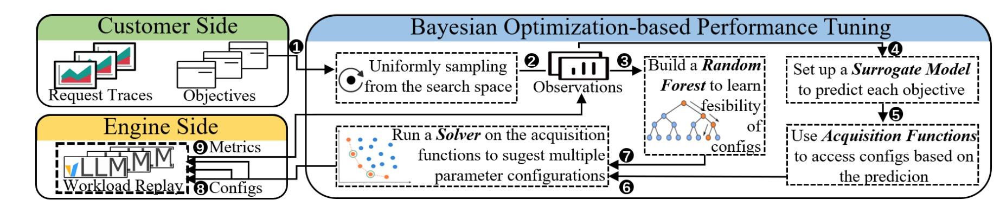

### SCOOT: SLO-Oriented Performance Tuning for LLM Inference Engines

This is the implementations of the paper [SCOOT: SLO-Oriented Performance Tuning for LLM Inference Engines](https://arxiv.org/html/2408.04323v1) 



`bo_scoot.py` is the script invovling the whole pipeline.

The shell script `tune_entry.sh` is used to reproduce the main results in the paper.


### Citation

```latex
@misc{cheng2024slooptimizedllmservingautomatic,
      title={Towards SLO-Optimized LLM Serving via Automatic Inference Engine Tuning}, 
      author={Ke Cheng and Zhi Wang and Wen Hu and Tiannuo Yang and Jianguo Li and Sheng Zhang},
      year={2024},
      eprint={2408.04323},
      archivePrefix={arXiv},
      primaryClass={cs.DC},
      url={https://arxiv.org/abs/2408.04323}, 
}
```

